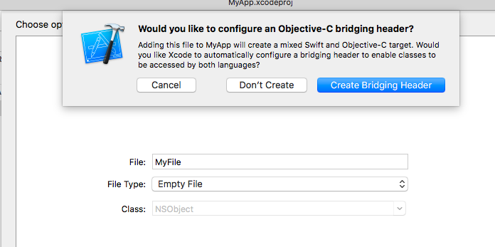

## Frameworks and Libraries

#### Method 6:  Objective-C framework on the command line.

Now, for our first framework, we will make a new Xcode framework in Objective C, called ``AdderOC``. Put ``add1.c`` and ``add2.c`` in the directory that holds the project files and then  Add Files... 

Add the function prototype declarations from ``add.h`` into ``AdderOC.h`` which Xcode provided for us. 

Build it. Use the Show in Finder trick to find and then drag the Framework to ~/Library/Frameworks.

Now we'll try to use the framework from the command line.

I specify the path to find the header folder which is in the framework.  We need ``useadd.c`` on the Desktop.

```bash
> clang -g -o useadd -F ~/Library/Frameworks/ -framework AdderOC useadd.c -I ~/Library/Frameworks/AdderOC.framework/Headers
>
```

And it works:

```bash
>  ./useadd
useadd
f1: 1;  main 2
f2: 10;  main 12
>
```

<hr>

#### Method 7:  Use a standard OS X framework from the command line:

test2.m

```objc
#import <Foundation/Foundation.h>
int main (int argc, const char* argv[]) {
    NSDictionary *eD = [[NSProcessInfo processInfo] environment];
    NSLog(@"%@",[[eD objectForKey:@"USER"] description]);
    return 0;
}
```

```bash
> clang -o test test2.m -framework Foundation
> ./test
2017-01-13 21:11:54.506 test[7792:197260] telliott_admin
>
```

<hr>

#### Method 8:  Objective-C framework linked from ~/Library/Frameworks.

Make a new Xcode project **MyApp**.

In the Xcode General tab under Linked Frameworks and Libraries, click the + button and then navigate to ``~/Library/Frameworks``, and link the framework to the project

In **AppDelegate.m**, put this line:

```objc
#import "AdderOC/AdderOC.h"
```
It builds now.  In the past I have run into trouble where Xcode says it can't find the header.  I fixed this by going to Build Settings > Search Paths > Framework Search Paths, and adding the path `~/Library/Frameworks`.

Add Library Search Paths as well (`~/Library/Frameworks/Adder.framework/Headers`).

Add this code to the AppDelegate:

```objc
int x = f1(1);
printf("AD: %d;", x);
```

It builds and logs this

```bash
f1: 1;AD: 2;
```

#### Method 9:  Objective-C framework from a Swift Cocoa app.

The basics: open a new Xcode project in Swift and call it MyApp. We need a "bridging header", we get this by adding a new Objective C file, then Xcode will ask if we want this header, and we say yes. 



Ungratefully, we promptly delete the dummy Objective C class. In the header, add:

```css
#import "AdderOC/AdderOC.h"
```

You also need to link to the framework, by adding it to Linked Libraries and Frameworks, as we did before.

Add this to **ApplicationDidFinishLaunching**

```css
let x = f1(1)
print("\nAD;  x:\(x)")
```

Build and run and  it will log

```css
f1: 1;
AD;  x:2
```

We even get the ``printf`` from C!

#### Method 10:  Import an Objective-C framework from a Swift program executing on the command line.  

**testAdder.swift**

```css
// @testable import Encryptor
import AdderOC

let x = f1(1)
print("\nAD;  x:\(x)")
```

```bash
> xcrun swiftc testAdder.swift -o prog -F ~/Library/Frameworks -sdk $(xcrun --show-sdk-path --sdk macosx) && ./prog
f1: 1;
AD;  x:2
>
```
We do `-F ~/Library/Frameworks` as before, and we also need to tell the linker where the SDK we are building for is located.

It all works!