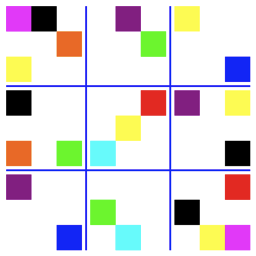

### Images

I do not have a real write-up on this topic yet.

I [posted](http://telliott99.blogspot.com/2015/12/images-and-icons.html) to the blog about it after figuring out how to get an icon for SudokuBlocks.app (now SudokuBlocks3.app).

I took another look at the code for dealing with images and updating to Swift3.  It's the usual:  slight tweaks to method names which can be more or less hard to figure out from the Apple docs.  I'd be sunk without Google.

An example:

```swift
let args = Process.arguments
```

is now 

```swift
let args = CommandLine.arguments
```

Too bad the documents at ``Process.arguments`` don't say anything about the change.  I only learned the right way to do this from [here](https://www.raywenderlich.com/128039).

Anyway, the code in ``Images`` folder in this repo works under Swift3.  An example

```bash
xcrun swift resizer.swift sudoku.png 256
```

resizes the image file to one 256 x 256 named ``sudoku.256.png``



or ``sudoku.64.png``.

 
