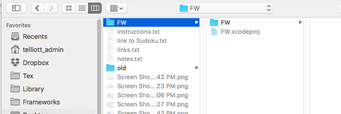
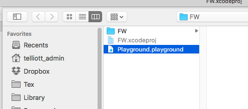

## Add a Framework to a Playground

Start by creating a new project in Xcode:

* OS X Cocoa Framework
* Swift
* name: **FW**

Select the FW folder:


New > File > New

* Swift file
* name: **File.swift**


```css
public class Talk {
    public class func hello() -> String {
        return "Hello from FW"
    }
}
```

I couldn't get **print** to work, but returning a value is more useful, anway.

* Build the project

With the project selected, 


Do 

* save as Workspace
* name:  **FW.xcworkspace**

Create a new Playground

Save it inside the project folder next to the Swift files.  We do save here:



You must still add the Playground to the project:



by doing AddToProject and navigating to the Playground file.

Build the FW project again.

In the playground:


```css
import FW
Talk.hello()
```

Result:

```css
Hello from FW
```

If you have issues issues make sure that in your
Xcode Preferences:  Locations > Advanced > confuration is 'Unique'.
