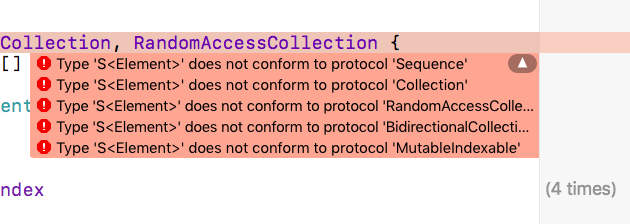

## Collection

This write-up is an elementary introduction to the **Collection** protocol in Swift. 

#### minimal working example

```css
import Foundation

struct S<T>:  Collection {
    var data: [T] = []
    init(input data: [T] = []) {
        self.data = data
    }
    var startIndex: Int { 
    		return data.startIndex 
    }
    var endIndex: Int {
    		return data.endIndex 
    }
    func index(after i: Int) -> Int { 
        return data.index(after: i) 
    }
    subscript(position: Int) -> T {
        get {
            return data[position]
        }
    }
}

var s = S(input: [4,2,3,1])
s.data      // [4, 3, 2, 1]
```

Here is a minimal working example.  Commenting out the function ``index`` gives the error:

```css
Type 'S<T>' does not conform to the protocol 'IndexableBase'
```

Removing ``subscript`` gives the same error.

Even with this simple code example, we get a number of  methods "for free."  We get ``sorted``

```css
s.data      // [4, 2, 3, 1]
s.sorted()  // [1, 2, 3, 4]
s.count     // 4
s.isEmpty   // false
let a = Array(s.prefix(upTo: 2)) // [4, 2]
for el in s { print(el) }
s.dropFirst().count  // 3
```

#### reworked

One change we can make is to recognize that it is usual to call the type ``Element`` rather than ``T``, though this is just a convention.

To be a **RandomAccessCollection**, we must add ``index(before:``

```css
    func index(before i: Int) -> Int {
        return data.index(before: i)
    }
```

To be a **MutableCollection**, we need to add a setter to ``subscript``

```css
    subscript(position: Int) -> Element {
        get {
            return data[position]
        }
        set {
            data[position] = newValue
        }
    }
```

What is strange is that although this change works in isolation, it doesn't work in combination with **RandomAccessCollection**.  Instead I get a whole bunch of new errors.



I found the answer [here](http://stackoverflow.com/questions/38810405).

To diagnose the problem, it was useful to run the code as a script from the command line

```
swift test.swift
```

The error messages were much more informative and suggested how to fix the code.  Also, the Playground seemed to just choke on the code sometimes.

It turns out that we need two things.  The first is a ``typealias``

```css
typealias Indices = Array<Element>.Indices
``` 

and then also, a version of subscript that takes a **Range**.  Here is the final version of the collection, evaluated in a Playground.

```css
import Foundation

struct S<Element>: MutableCollection,
RandomAccessCollection {
    
    typealias Indices = Array<Element>.Indices
    
    var data: [Element] = []
    
    init(input data: [Element] = []) {
        self.data = data
    }
    var startIndex: Int {
        return data.startIndex
    }
    var endIndex: Int {
        return data.endIndex
    }
    func index(after i: Int) -> Int {
        return data.index(after: i)
    }
    func index(before i: Int) -> Int {
        return data.index(before: i)
    }
    subscript(position: Int) -> Element {
        get {
            return data[position]
        }
        set {
            data[position] = newValue
        }
    }
    subscript(bounds: Range<Int>) -> S<Element> {
        get {
            return S(input: Array(data[bounds]))
        }
        set {
            data[bounds] = ArraySlice(newValue.data)
        }
    }
}


var s = S(input: [4,2,3,1])
print("\(s[0..<2])")

s.data      // [4, 2, 3, 1]
s.sorted()  // [1, 2, 3, 4]
s.count     // 4
s.isEmpty   // false
```

So there you have it, the minimal example for a **Collection**, a **MutableCollection**, and a **RandomAccessCollection**.

#### So what's with the *typealias*?

```css
typealias Indices = Array<Element>.Indices
```

Apparently somewhere there is code like:

```css
protocol MutableCollection {
    typealias Indices: _______
```