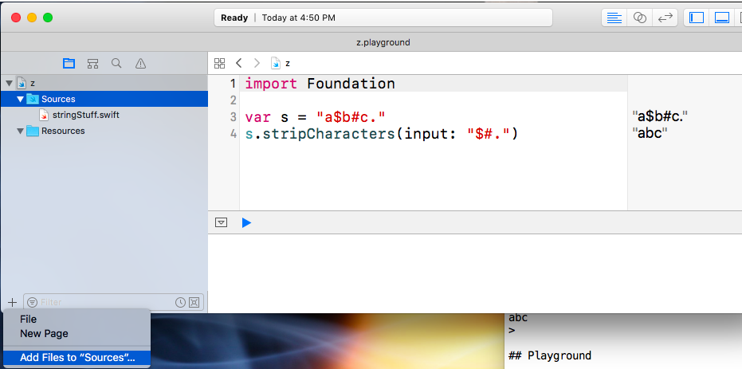
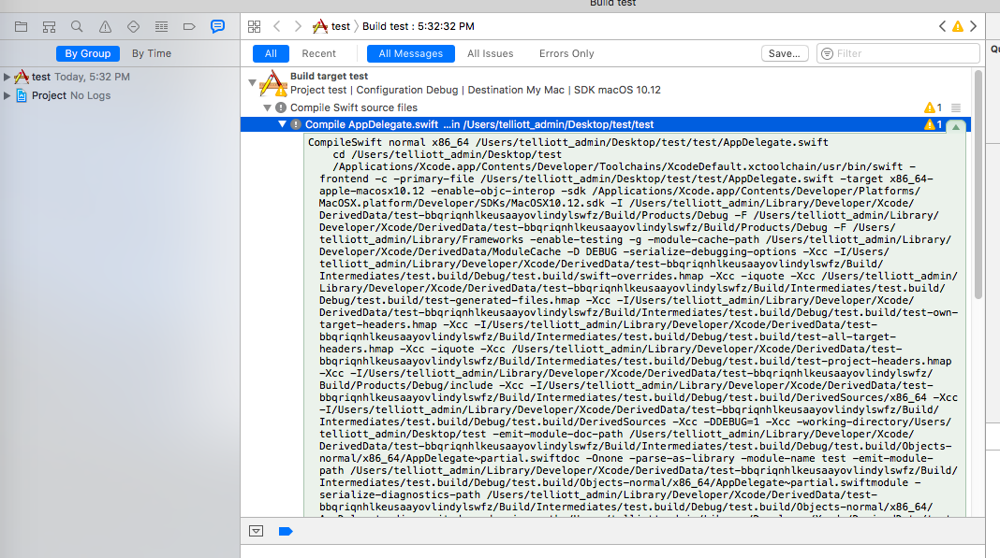
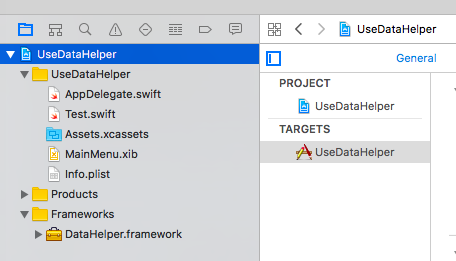
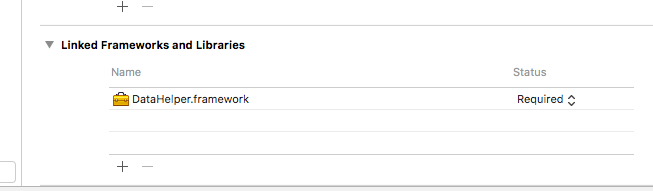

## Multiple files with code --- frameworks

Even for small projects, it is nice to have the ability to split up your code into several files.

For example, I put the latest versions of a bunch of utility functions for dealing with data (that is [UInt8]) into the **DataHelper** framework.  I'll introduce them briefly at the end.

In Swift, we can do this in different ways.  Three that we discuss here are:  working from the command line, adding resources to a Playground, or making a framework.

### Command line

**stringStuff.swift**:

```css
import Foundation

extension String {
    func stripCharacters(input: String) -> String {
        let badChars = input.characters
        let ret = self.characters.filter {
            !badChars.contains($0) }
        return String(ret)
    }
}
```

**main.swift**:

```css
var s = "a$b#c."
print(s.stripCharacters(input: "$#."))
```

This name for the main file is required.  On the command line:

```css
> swiftc stringStuff.swift main.swift -o prog && ./prog
abc
>
```

### Playground

I followed the instructions [here](http://help.apple.com/xcode/mac/8.0/#/devfa5bea3af) to copy the file **StringStuff.swift** to the Sources folder of a Playground project.



Import of the code as a module happens automatically, there is no need for an import statment.  An important difference from the first method is that the symbols to be accessed must be marked ``public``.

### Framework

To build the framework, follow my instructions [here](http://telliott99.blogspot.com/2015/12/building-and-using-framework-in-swift.html).

In Xcode do:  

* OS X > New Project > Cocoa Framework > Swift

* name:  StringStuff.framwork

* Add the Swift file stringStuff.swift

* Build it

* Under Products, find StringStuff.framework

* Control-click to Show In Finder, drag to Desktop


Finally

```css
cp -r StringStuff.framework ~/Library/Frameworks
```

To use the new Framework

**x.swift**:

```css
import StringStuff
var s = "a$b#c"
print(s.stripCharacters(input: "$#"))
```

From the command line:

```css
xcrun swiftc x.swift -F ~/Library/Frameworks -sdk $(xcrun --show-sdk-path --sdk macosx)
```

This should work but fails with an error:

```css
x.swift:1:8: error: module file's minimum deployment target is OS X v10.12: /Users/telliott_admin/Library/Frameworks/StringStuff.framework/Modules/StringStuff.swiftmodule/x86_64.swiftmodule
import StringStuff
       ^
```

I will show how to fix this problem below.

Meanwhile, I made a new Xcode project.  I added the String Stuff Famework to "Linked Frameworks and Libraries" following the instructions [here](http://telliott99.blogspot.com/2015/12/building-and-using-framework-in-swift.html):

I put the three lines of code from above into the **AppDelegate**.  When built and run, it logs what we expect to the Debug area.

## Command line and target

Our current situation is that when **x.swift** is contained in an Xcode project it can find and use the StringStuff Framework from ``~/Library/Frameworks/StringStuff.framework``, but when we try from the command line it fails.

Some good advice, which I found [here](http://onebigfunction.com/tools/2015/02/03/xcrun-execute-xcode-tasks-from-command-line/), is to examine the commands Xcode issued to compile **x.swift**.  



One of the very first flags to the compiler is

```css
-target x86_64-apple-macosx10.12
```

Let's try it:

```css
> xcrun swiftc x.swift -F ~/Library/Frameworks -sdk $(xcrun --show-sdk-path --sdk macosx) -target x86_64-apple-macosx10.12
> ./x
abc
>
```

It works!

The **DataHelper** framework is in ``~/Library/Frameworks``.  Just make a new Xcode project that is a Framework and place in it a Swift file with the functions you want to make available.  Mine has

```css
public func byteToHex(_ input: UInt8) -> String
public func byteArrayToHex(_ input: [UInt8], 
        withSpaces: Bool = false) -> String

public func removePrefix(_ input: String, sz: Int = 2) -> String
public func chunks <T> (_ input: [T], sz: Int = 2) -> [[T]]
public func string_chunks (_ input: String, sz: Int = 2) -> [String]
public func isValidByteString(_ input: String) -> Bool
public func removeWhitespace(_ input: String) -> String

public extension String {
    public func stripCharactersInList(_ cL: CharacterView) -> String
    public func splitOnStringCharacter(s: String) -> [String]
    
public func singleHexToByte(_ input: String) -> UInt8
public func hexToBytes(_ input: String) -> [UInt8]

public func fourRandomBytes() -> [UInt8]
public func nRandomBytes(_ count: Int = 4) -> [UInt8]

public func testDataHelper()
```

To test it, I made a new Cocoa app and linked to the Framework.  To do this, just click on the project icon:



and then click on the "+" in Linked Frameworks



and navigate to the Framework.

I wrote a small class

**Test.swift**:

```css
import Cocoa
import DataHelper

class BinaryData: CustomStringConvertible {
    var data: [UInt8]
    init(_ input: [UInt8]) {
        self.data = input
    }
    var description: String {
        get {
            return "0x" + byteArrayToHex(data)
        }
    }
    convenience init(_ input: String) {
        self.init(hexToBytes(input))
    }
}
```

One detail is that the import of DataHelper must be in the same file, doing the import in the AppDelegate doesn't work.  Also, we have a minimal example of a "convenience" **init** function.

Put this code into either the **AppDelegate** or **Text.swift**

```css
func test() {
        let d1 = BinaryData([1,2,255])
        print(d1)
        let d2 = BinaryData("0affed25")
        print(d2)
    }
```

When built and run, it will log:

```css
0x0102ff
0x0affed25
```

as expected.  To use the Framework from the command line, do **import DataHelper**, call **testDataHelper()** from a file **test.swift** and then do:

```css
> xcrun swiftc test.swift -F ~/Library/Frameworks -sdk $(xcrun --show-sdk-path --sdk macosx) -target x86_64-apple-macosx10.12  && ./test
0a
0x0001ff4d60
0001ff4d60
32
["ab", "ra", "ca", "da", "br", "a"]
abcd
[170, 255, 13]
[170, 255, 13]
[170, 255, 13]
e344a9e41c73830117c4322318a923b4c6bdd64ab735c2fd
[227, 68, 169, 228, 28, 115, 131, 1, 23, 196, 50, 35]
[24, 169, 35, 180, 198, 189, 214, 74, 183, 53, 194, 253]
>
```